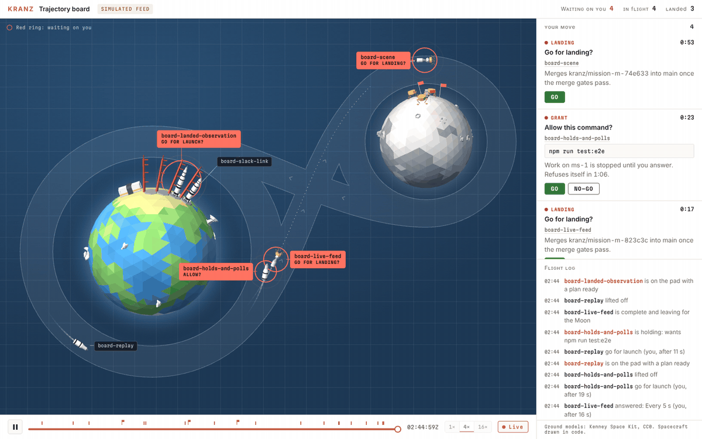

# Trajectory board prototype (reference only)

A single-page prototype of the board described in
[`../trajectory-board.md`](../trajectory-board.md). It is the visual and
behavioral reference for the `trajectory-board-*` tickets. Nothing here is
built by CI, shipped in a release, or part of the dashboard bundle. Delete this
folder once the board lens has reached parity (see "Done when" in the design
note).



## Run it

```sh
node build.mjs
python3 -m http.server 5173 --bind 127.0.0.1 --directory dist
```

`build.mjs` needs Node 18 or newer and has no dependencies. It writes
`dist/board.html`, which is ignored by git.

| Address | What it shows |
|---|---|
| `http://localhost:5173/board.html` | A simulated feed. Every decision button acts on the simulation. |
| `http://localhost:5173/board.html#kranz` | A read-only view of the `kranz serve` on `127.0.0.1:4560`. |
| `http://localhost:5173/board.html#kranz@http://127.0.0.1:4570` | The same, for a serve on another loopback port. |

Port 5173 is deliberate. A real serve answers browser pages only from its own
origin, the two dev-server ports and the Tauri shell (`origin_allowed` in
`crates/server/src/lib.rs`), so a page served from any other port is refused.

The page loads three.js 0.147.0 and one font from public CDNs. Without network
access it falls back to the 2D layer and system fonts.

## Files

| File | Role |
|---|---|
| `src/sim.js` | Simulated feed in the server's event shape, with a scripted backstory. |
| `src/kranz.js` | Read-only adapter over the REST API. Never sends a POST. |
| `src/fold.js` | Events to fleet: stage, pad, lane and landing-site allocation, what is waiting. |
| `src/profile.js` | Figure-8 geometry, each craft's timeline, and its pose at a given time. |
| `src/scene.js` | three.js scene: spacecraft drawn in code, Earth, Moon, pads, flags, kit props. |
| `src/chart.js` | 2D layer: the route, trails, red rings, label leaders, and stand-ins when WebGL is missing. |
| `src/ui.js` | Page controller: clock and replay, labels, the "your move" list, the flight log. |
| `src/template.html` | Markup and styles. |
| `test/logic.mjs` | Headless checks of the simulator, the fold and the flight plan. |
| `kit/` | Twelve third-party models (see below). |

## Checks

```sh
node test/logic.mjs compose
node test/logic.mjs soak 600 mixed
```

`compose` asserts that the opening frame shows one craft at every stage.
`soak` runs ten simulated minutes in the wide and tall layouts with a scripted
operator and exits non-zero on a non-finite pose value, a position jump, two
craft in one lane, a replay that disagrees with the live fold, or a gap in a
mission's event sequence.

## What has been verified, and what has not

Verified in headless Chromium with WebGL. Those browser tests depend on
Playwright and are not included here.

- The simulated feed renders at desktop, tablet and phone widths, in light and
  dark schemes.
- The landing sequence, the free return and splashdown of a failed mission, and
  a scrubbed mission.
- Replay agrees with live.
- Fallbacks: no WebGL, CDN unreachable, font unreachable.
- The 2D and 3D layers agree on positions.
- Live mode against `scripts/mock-server.mjs`: the board follows a mission from
  creation through plan approval, start and completion, and reports a lost
  server.

Not verified: live mode against a real `kranz serve`. The mock server has no
`/api/tickets` or `/api/repos` route, so the ticket join and the repo-scoped
paths in `src/kranz.js` have never seen real responses.

## Where the prototype differs from what the dashboard needs

- It folds the event log in the browser. The dashboard treats the server's fold
  as the single source of truth (design note, D-B).
- Its buttons act on the simulation, and in live mode it has none (D-C).
- It knows five kinds of ask. The server has more (D-D).
- It uses three.js 0.147 through the `THREE` global and `examples/js`, both of
  which later releases removed (D-E).
- It carries its own color tokens, including a dark scheme the dashboard does
  not have.
- It replays history from the event log. The first version of the lens does
  not.

## Third-party material

- `kit/*.glb` are twelve models from Kenney's Space Kit 2.0, released under
  CC0 1.0. `kit/License.txt` is the kit's own license text, with its line
  endings normalized to LF as this repository requires. The models were taken
  from the npm package `@anabis/kenney-space-kit-mirror@2.0.0`, an unofficial
  mirror that states its files are unmodified. They have not been compared with
  the original download at <https://kenney.nl/assets/space-kit>. The build
  leaves out any model that is missing, and the scene then omits that prop.
- three.js (MIT) and the Martian Mono font (OFL) are loaded at run time and are
  not vendored here.

SHA-256 of the twelve models as committed:

```text
9db62dd9790beadc1b8e45cf9623e99ade21751bb23f16dfe1b8cfb05a54f3b5  astronautA.glb
6fa5b3e11cb3d117b28a0794b261ad9107f16ca6ce886b288493e22493d74d2d  astronautB.glb
8b872ebe7358e1d5f08c600ed43f61d4d0dbbd03274a718424c599778915b175  crater.glb
703f86c085371d5e53e39029a0c74e51cefccd02697ea5e00eb2b4235ed9011b  craterLarge.glb
c78ab6ed17adf2f2ffa860046d92e1ea30fc84a2dd35377382dad04b48064817  hangar_largeB.glb
dbc02af619e176d10676ceb0e788d0bf8838731bef0d50972f11c7bf5d1f4922  rock.glb
13b2bf393fcd7ca8c73d8a2a731da0be6c2c2b4e67ef0ae826e816c0d8733f2f  rock_largeA.glb
9ad6aafcbdf3a813d3ab5ca59d6d6eb41d8cb38d07897b2c4d24c3206f33c759  rock_largeB.glb
4c56d53f1da96654ed02041c0cb493c30de266f0d273d528e5ac92b92e6edb8b  rocks_smallA.glb
d59c89345555850d1c6240f2ab7347d8befeeea1ddc4413e54acee9b2d52cccf  rocks_smallB.glb
9784549775017e540ab84e6fc0eb8a1902dbeff9ba4285cecb97c086d2937fa5  rover.glb
8fe696a37081a0a6f1c56ab867f447f33a498ef9f1daabb5aabc62b1ce09277e  satelliteDish_large.glb
```
